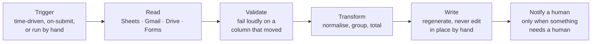

# Google Workspace Automation Lab

`TECHNICAL LAB`

**This is a lab, not client work.** Every file here was written for this
repository. No client's script, spreadsheet, mailbox or folder structure is
reproduced. The completed client engagements live in
**[google-workspace-apps-script-automation](https://github.com/skmalikllc/google-workspace-apps-script-automation)**
— this is the readable version of the building blocks behind them.

There is no CI badge on this repository, because Apps Script runs inside Google
and cannot be meaningfully unit-tested in GitHub Actions. I would rather have no
badge than a decorative one.

---

## Why a lab, and not more case studies

Most Apps Script work is the same half-dozen moves in a different order. Rather
than describe them six times inside sanitized case studies where I cannot show
the code, this repository shows the code with no client attached to it.

## The files

| File | What it does | The rule it encodes |
|---|---|---|
| [`DriveFolderStructure.gs`](src/DriveFolderStructure.gs) | Builds a folder tree from a declarative spec | **Idempotent.** Running it twice must not create `Clients (1)`. It also warns on duplicate folder names, which Drive allows and which are always a mistake. |
| [`SheetSummaryReport.gs`](src/SheetSummaryReport.gs) | Groups and totals a data tab into a summary tab | **A report is regenerated, never edited.** Blank keys and non-numeric values are counted and reported, not silently treated as zero. |
| [`GmailLabelRules.gs`](src/GmailLabelRules.gs) | Applies label rules across a mailbox backlog | **Bounded and resumable**, because Apps Script has a ~6 minute limit and a real backlog does not fit in it. Ships with a `preview` function — always run that first on someone else's mailbox. |
| [`FormResponseHandler.gs`](src/FormResponseHandler.gs) | Validates a form submission, logs it, flags duplicates | **Notify on exceptions, log everything.** A notification that fires on every submission is muted within a week. Duplicate detection uses a reference number, because a reference is a key and a name is not. |
| [`DocFromTemplateToPdf.gs`](src/DocFromTemplateToPdf.gs) | Fills a Docs template and exports a PDF | **Always work on a copy.** Editing the template means run two has run one's data baked in. It also warns about placeholders that were never replaced. |
| [`TriggerManagement.gs`](src/TriggerManagement.gs) | Installs and lists time-driven triggers | **Delete before you create.** Re-running an install function is the commonest way a script ends up firing four times a night. |

## Using any of it

1. Open the target Sheet or Doc → **Extensions → Apps Script**.
2. Paste the file you want into a new script file.
3. Edit the constants at the top — none of them are set to anything real.
4. Run the function once from the editor to grant the OAuth scopes it needs.
5. For anything scheduled, use `installDailyTrigger` rather than adding a
   trigger by hand, so a second install does not double it.

**Run the preview function first** on any script that touches a mailbox or
deletes anything. On a client account, that is not optional.

## Scope of what is claimed

| Area | Level |
|---|---|
| Apps Script: Sheets, Gmail, Drive, Forms, Docs, triggers | Verified client work + the code here |
| Google Workspace admin troubleshooting | Verified — one completed Upwork contract, rated 5.0 |
| Programmatic form generation at scale | Verified — a 617-question conditional form generated with Apps Script |
| Workspace-wide admin, security policy, DLP, Vault | **Not claimed.** |
| Google Cloud / Apps Script advanced services beyond the above | **Not claimed.** |

## Related

**[google-workspace-apps-script-automation](https://github.com/skmalikllc/google-workspace-apps-script-automation)** — the completed client engagements ·
**[gmail-business-inbox-organization](https://github.com/skmalikllc/gmail-business-inbox-organization)** — mailbox systems delivered for clients ·
**[table-to-sheets](https://github.com/skmalikllc/table-to-sheets)** — getting data *into* Sheets when a site will not export ·
**[automation-portfolio](https://github.com/skmalikllc/automation-portfolio)** — the full index.

## Licence

MIT.
